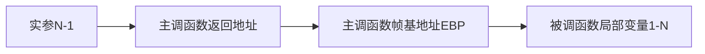

程序的执行过程可看作连续的函数调用。当一个函数执行完毕时，程序要回到调用指令的下一条指令(紧接call指令)处继续执行。函数调用过程通常使用堆栈实现，每个用户态进程对应一个调用栈结构(call stack)。编译器使用堆栈传递函数参数、保存返回地址、临时保存寄存器原有值(即函数调用的上下文)以备恢复以及存储本地局部变量。 

不同处理器和编译器的堆栈布局、函数调用方法都可能不同，但堆栈的基本概念是一样的。

## 栈帧结构
**栈帧**是指为一个函数调用单独分配的那部分栈空间。当运行中的程序调用另一个函数时，就要进入一个新的栈帧，原来函数的栈帧称为调用者的帧，新的栈帧称为当前帧。被调用的函数运行结束后当前帧全部收缩，回到调用者的帧。

  
这里用到了两个寄存器，`%ebp`是帧指针，它总是指向当前帧的底部；`%esp`是栈指针，它总是指向当前帧的顶部。这两个寄存器用来定位当前帧中的所有空间，在后面的代码中将会经常出现。编译器需要根据IA32指令集的规则小心翼翼地调整这两个寄存器的值，一旦出错，参数传递、函数返回都可能出现问题。
下面来看一个例子。函数`caller`中调用函数`swap_add`，完成交换并相加的工作，C代码如下：
```c
int swap_add(int *xp, int *yp)
{
    int x = *xp;
    int y = *yp;
    *xp = y;
    *yp = x;
    return x + y;
}

int caller()
{
    int arg1 = 534;
    int arg2 = 1057;
    int sum = swap_add(&arg1, &arg2);
    int diff = arg1 - arg2;
    return sum * diff;
}
```
首先，程序从`caller`开始运行，为了详细说明每一行程序都做了什么操作，我们将`caller`函数的C代码编译成汇编码，并给每一句附上注释。

进入`caller`函数后，先调整两个指针的值，第2行保存旧的帧指针到当前的栈顶位置，第3行将当前栈指针的值赋值给帧指针，此时，帧指针和栈指针都指向栈顶。第4行将栈指针减小24，意思是从栈中申请24字节的空间作为当前帧空间（即`caller`函数所用的帧空间，至于为什么是24字节，我们最后再说）。现在，刚刚完成了预处理工作，接下来就要实现函数体要完成的功能。

分析下一步代码之前，我们先回过头来对照一下前面的栈帧结构图，将`caller`视为调用者的帧，预处理工作完成后，此时的帧指针指向调用者的帧的底部（在图中以我们的视角来看是上面），而栈指针指向调用者的帧的顶部。

在C代码中，我们给两个整型变量分别赋了值。对应的汇编代码为第5行，将`534`存入栈的`-4(%ebp)`位置，这是一个基址+偏移量寻址，即`%ebp`中的数减4的地址。第6行同理。对应栈帧结构图，`534`和`1057`就保存在调用者的帧的底部和参数n之间的某个位置。接下来计算两个整型变量的地址，并将其作为`swap_add`的参数。在汇编代码中，函数调用的参数传递是通过把参数依次放在靠近调用者的帧的顶部来实现的。那么这两个参数就应该放在相对于当前栈顶指针`%esp`的+4和+0位置，第7~10行就在做这个操作。放置好参数后，就可以正式调用函数`swap_add`了，如第11行的指令。`call`指令不仅仅是跳转到子函数的位置，而且还要为子函数的正确返回做准备。事实上，`call`指令可以分为两步，第一步将当前程序段的下一行代码的地址入栈，第二步才是跳转到子函数的代码段，相当于如下两行指令。
```text
pushl [下一句代码的地址]
jmp swap_add
```
至此，在`swap_add`函数代码执行前，调用者的帧已经准备完毕。可以注意到，栈帧结构图中调用者的帧的栈顶正是`call`指令压入的下一行代码的地址，后面将会介绍这个地址的用途。

接下来看`swap_add`函数的汇编代码。
```text
1    swap_add:
2        pushl %ebp              #Save old %ebp
3        movl %esp, %ebp         #Set %ebp as frame pointer
4        pushl %ebx              #Save %ebx

5        movl 8(%ebp), %edx      #Get xp
6        movl 12(%ebp), %ecx     #Get yp
7        movl (%edx), %ebx       #Get x
8        movl (%ecx), %eax       #Get y
9        movl %eax, (%edx)       #Store y at xp
10       movl %ebx, (%ecx)       #Store x at yp
11       addl %ebx, %eax         #Return value = x+y

12       popl %ebx               #Restore %ebx
13       popl %ebp               #Restore %ebp
14       ret                     #Return
```
这段代码被我人为地分割成了三部分。2~4行为预处理部分，同前面分析过的预处理相似，保存旧的帧指针，设置新的帧指针。但多了一步，在第4行将`%ebx`寄存器入栈。该操作是为了保存`%ebx`寄存器的值，以便在函数结束时恢复原值，即第12行的`popl %ebx`。

5~11行为`swap_add`函数的功能实现代码。首先第5、6行从调用者的帧中取出之前保存的两个参数，可以看到，这两个参数相对于当前帧指针的偏移量为+8和+12。然后第7、8行将参数的值作为地址取出对应的两个数（这两个数实际上是`caller`代码中第5、6行存入的数），存入`%ebx`和`%eax`寄存器。第9、10行将两个数交换放回原来的地址。第11行将两个数相加，和作为返回值保存在`%eax`寄存器。

12~14行为结束代码，做一些函数的收尾工作。首先第12行恢复`%ebx`寄存器的值，接着第13行恢复`%ebp`寄存器的值，最后`ret`返回。而`ret`指令也分为两步，第一步取出当前栈顶的值，第二步将这个值作为跳转指令的地址跳转，相当于下面两行代码。
```text
popl %edx
jmp %edx
```
现在可以回收前面的伏笔了。想想看这里弹出的地址是哪来的？不错，正是`call`指令自动压栈的下一行代码的地址。因此，`ret`之后将会执行`call swap_add`指令紧跟着的下一行代码。好的，接下来给出`caller`函数剩下的汇编代码。
```text
12       movl -4(%ebp), %edx
13       subl -8(%ebp), %edx
14       imull %edx, %eax
15       leave
16       ret
```
12~14行都是在完成之后的一些运算而已，不必追究。奇怪的是15行用了一个没见过的指令`leave`，这又是什么意思呢？

我们来分析一下，这段代码和`swap_add`最后三行代码相比，少了两句`popl %ebx`和`popl %ebp`，多了一句`leave`。首先，`popl %ebx`不用考虑了，因为在`caller`的开头并没有`pushl %ebx`，因此也就没必要`popl %ebx`。那么我猜测`leave`是否替代了`popl %ebp`的功能呢？要想弄明白这个问题，首先我们得理解`popl %ebp`到底是什么功能。

很简单，每个函数结束前需要将栈恢复到函数调用前的样子，其实就是恢复两个指针——帧指针和栈指针的位置。`popl %ebp`的作用就是恢复帧指针的位置。而栈指针`%esp`呢？似乎没有看到哪条指令把它恢复。让我们再仔细捋一遍。先看子函数`swap_add`运行过程中的栈指针。使栈指针变化的只有四条语句，2、4行的`pushl`指令和12、13行的`popl`指令，而且两对指令对栈指针的影响正好对消，于是栈指针在函数结束时已经回到了最初的位置，因此根本不需要额外的调整。再考虑`caller`函数，与`swap_add`不同的地方在于第4行申请了24字节的栈空间，即手动将`%esp`寄存器的值减去了24。这就导致函数结束时栈指针无法回到最初的位置，需要我们手动将它恢复，`leave`指令就是这个作用。该指令相当于下面两条指令的合成。
```text
movl %ebp, %esp   #Set stack pointer to the beginning of frame
popl %ebp         #Restore the saved %ebp and set stack pointer to the end of caller's frame
```
先将栈指针恢复到当前帧的起始位置，再恢复帧指针。这样的话，在第二步恢复帧指针的时候栈指针也会自动减一，从而完全退出了当前帧。

最后再来解释栈帧为什么申请了24字节的空间。在现代处理器中，栈帧必须16字节对齐，就是说栈底和栈顶的地址必须是16的整数倍。至于为什么会有这样的要求，请查看下一篇文章《联合、数据对齐和缓冲区溢出攻击》。现在，既然要求是16的整数倍，24字节肯定是不够的，仔细观察就能明白，栈帧除了这额外申请的24字节空间外，还有最初压栈的`%ebp`寄存器占用4字节，以及调用子函数前保存的返回地址占用4字节，加起来正好32字节，实现了16字节对齐。

函数调用时的栈结构变化是个迷人的过程，编译器的精妙之处在此可见一斑。透过现象看本质，我们才真正接触到了程序本身。
## 寄存器使用惯例

在上面的叙述中有一现象尚未解释，为什么`caller`中没有保存`%ebx`而`swap_add`中却保存了呢？这涉及到IA32指令集的寄存器使用惯例，这个惯例保证了函数调用时寄存器的值不会丢失或紊乱。

`%eax`、`%edx`和`%ecx`称为**调用者保存**寄存器，被调用者使用这三个寄存器时不必担心它们原来的值有没有保存下来，这是调用者自己应该负责的事情。

`%ebx`、`%esi`和`%edi`称为**被调用者保存**寄存器，被调用者如果想要使用它们，必须在开始时保存它们的值并在结束时恢复它们的值，一般通过压栈和出栈来实现。

这就可以解释我们的疑问了。由于`%ebx`是被调用者保存寄存器，因此在`swap_add`中我们通过`pushl %ebx`和`popl %ebx`来保存该寄存器的值在函数执行前后不变。

## 这段代码的含义？

下面的代码片段常常出现在库函数的汇编代码中。
```text
    call next
next:
    popl %eax
```
乍看上去好像很奇怪，调用的`next`函数中并没有`ret`语句。这三行代码有什么作用呢？或者说，最后`%eax`寄存器的值会是什么呢？

相信理解了本文前两部分的读者应该很容易分析出来。`call`指令执行时会把下一句代码的地址压栈，此处对应于第三行`popl %eax`的地址。之后跳转到第三行执行，正好把刚才压栈的内容弹出到`%eax`寄存器中，这个值正好是当前的程序计数器的值。

这是汇编代码的一个习惯用法，结果是把`popl`指令地址放入`%eax`中——这是**将程序计数器值放入寄存器的唯一方法**。


## 为什么c语言中函数的参数是值传递？
```C
1 #include <stdio.h>
2
3 void swap(int a, int b) {
4     int t = a;
5     a = b;
6     b = t;
7 }
8
9 void main() {
10     int a = 2;
11     int b = 3;
12     swap(a, b);
13     printf("a is %d, b is %d\n", a, b);
14 }
```
可以看到，在 swap 函数中，a 和 b 的值做了一次交换，但是在 main 函数里，打印 a和 b 的值，a 还是 2，b 还是 3。这是为什么呢？从栈帧的角度，这个问题就非常容易理解：

在 main 函数执行的时候，main 的栈帧里存在变量 a 和 b。当 main 在调用 swap 方法的时候，会在 main 的帧下面新建 swap 的栈帧。swap 的帧里也有局部变量 a 和 b，但是明显这个 a、b 与 main 函数里的 a、b 没有任何关系，不管对 swap 的帧里的 a/b 变量做任何操作都不会影响 main 函数的栈帧。

## (IA32)Intel 32位体系结构寄存器

Intel 32位体系结构(简称IA32)处理器包含8个四字节寄存器，如下图所示：


最初的8086中寄存器是16位，每个都有特殊用途，寄存器名城反映其不同用途。由于IA32平台采用平面寻址模式，对特殊寄存器的需求大大降低，但由于历史原因，这些寄存器名称被保留下来。在大多数情况下，上图所示的前6个寄存器均可作为通用寄存器使用。某些指令可能以固定的寄存器作为源寄存器或目的寄存器，如一些特殊的算术操作指令imull/mull/cltd/idivl/divl要求一个参数必须在%eax中，其运算结果存放在%edx(higher 32-bit)和%eax (lower32-bit)中；又如函数返回值通常保存在%eax中，等等。为避免兼容性问题，ABI规范对这组通用寄存器的具体作用加以定义。

对于寄存器%eax、%ebx、%ecx和%edx，各自可作为两个独立的16位寄存器使用，而低16位寄存器还可继续分为两个独立的8位寄存器使用。编译器会根据操作数大小选择合适的寄存器来生成汇编代码。在汇编语言层面，这组通用寄存器以%e(AT&T语法)或直接以e(Intel语法)开头来引用，例如mov $5, %eax或mov eax, 5表示将立即数5赋值给寄存器%eax。

在x86处理器中，EIP(Instruction Pointer)是指令寄存器，指向处理器下条等待执行的指令地址(代码段内的偏移量)，每次执行完相应汇编指令EIP值就会增加。ESP(Stack Pointer)是堆栈指针寄存器，存放执行函数对应栈帧的栈顶地址(也是系统栈的顶部)，且始终指向栈顶；EBP(Base Pointer)是栈帧基址指针寄存器，存放执行函数对应栈帧的栈底地址，用于C运行库访问栈中的局部变量和参数。

注意，EIP是个特殊寄存器，不能像访问通用寄存器那样访问它，即找不到可用来寻址EIP并对其进行读写的操作码(OpCode)。EIP可被jmp、call和ret等指令隐含地改变(事实上它一直都在改变)。

不同架构的CPU，寄存器名称被添加不同前缀以指示寄存器的大小。例如x86架构用字母“e(extended)”作名称前缀，指示寄存器大小为32位；x86_64架构用字母“r”作名称前缀，指示各寄存器大小为64位。

编译器在将C程序编译成汇编程序时，应遵循ABI所规定的寄存器功能定义。同样地，编写汇编程序时也应遵循，否则所编写的汇编程序可能无法与C程序协同工作。

>扩展阅读】**栈帧指针寄存器**<br><br>为了访问函数局部变量，必须能定位每个变量。局部变量相对于堆栈指针ESP的位置在进入函数时就已确定，理论上变量可用ESP加偏移量来引用，但ESP会在函数执行期随变量的压栈和出栈而变动。尽管某些情况下编译器能跟踪栈中的变量操作以修正偏移量，但要引入可观的管理开销。而且在有些机器上(如Intel处理器)，用ESP加偏移量来访问一个变量需要多条指令才能实现。<br><br>因此，许多编译器使用帧指针寄存器FP(Frame Pointer)记录栈帧基地址。局部变量和函数参数都可通过帧指针引用，因为它们到FP的距离不会受到压栈和出栈操作的影响。有些资料将帧指针称作局部基指针(LB-local base pointer)。<br><br>在Intel CPU中，寄存器BP(EBP)用作帧指针。在Motorola CPU中，除A7(堆栈指针SP)外的任何地址寄存器都可用作FP。当堆栈向下(低地址)增长时，以FP地址为基准，函数参数的偏移量是正值，而局部变量的偏移量是负值。

程序寄存器组是唯一能被所有函数共享的资源。虽然某一时刻只有一个函数在执行，但需保证当某个函数调用其他函数时，被调函数不会修改或覆盖主调函数稍后会使用到的寄存器值。因此，IA32采用一套统一的寄存器使用约定，所有函数(包括库函数)调用都必须遵守该约定。

根据惯例，寄存器%eax、%edx和%ecx为主调函数保存寄存器(caller-saved registers)，当函数调用时，若主调函数希望保持这些寄存器的值，则必须在调用前显式地将其保存在栈中；被调函数可以覆盖这些寄存器，而不会破坏主调函数所需的数据。寄存器%ebx、%esi和%edi为被调函数保存寄存器(callee-saved registers)，即被调函数在覆盖这些寄存器的值时，必须先将寄存器原值压入栈中保存起来，并在函数返回前从栈中恢复其原值，因为主调函数可能也在使用这些寄存器。此外，被调函数必须保持寄存器%ebp和%esp，并在函数返回后将其恢复到调用前的值，亦即必须恢复主调函数的栈帧。

当然，这些工作都由编译器在幕后进行。不过在编写汇编程序时应注意遵守上述惯例。


## 栈帧结构

函数调用经常是嵌套的，在同一时刻，堆栈中会有多个函数的信息。每个未完成运行的函数占用一个独立的连续区域，称作栈帧(Stack Frame)。栈帧是堆栈的逻辑片段，当调用函数时逻辑栈帧被压入堆栈, 当函数返回时逻辑栈帧被从堆栈中弹出。栈帧存放着函数参数，局部变量及恢复前一栈帧所需要的数据等。

编译器利用栈帧，使得函数参数和函数中局部变量的分配与释放对程序员透明。编译器将控制权移交函数本身之前，插入特定代码将函数参数压入栈帧中，并分配足够的内存空间用于存放函数中的局部变量。使用栈帧的一个好处是使得递归变为可能，因为对函数的每次递归调用，都会分配给该函数一个新的栈帧，这样就巧妙地隔离当前调用与上次调用。

栈帧的边界由栈帧基地址指针EBP和堆栈指针ESP界定(指针存放在相应寄存器中)。EBP指向当前栈帧底部(高地址)，在当前栈帧内位置固定；ESP指向当前栈帧顶部(低地址)，当程序执行时ESP会随着数据的入栈和出栈而移动。因此函数中对大部分数据的访问都基于EBP进行。

为更具描述性，以下称EBP为帧基指针， ESP为栈顶指针，并在引用汇编代码时分别记为%ebp和%esp。

 函数调用栈的典型内存布局如下图所示：
 


图中给出主调函数(caller)和被调函数(callee)的栈帧布局，”m(%ebp)”表示以EBP为基地址、偏移量为m字节的内存空间(中的内容)。
该图基于两个假设：
第一，函数返回值不是结构体或联合体，否则第一个参数将位于”12(%ebp)” 处；
第二，每个参数都是4字节大小(栈的粒度为4字节)。
此外，函数可以没有参数和局部变量，故图中“Argument(参数)”和“Local Variable(局部变量)”不是函数栈帧结构的必需部分。

从图中可以看出，函数调用时入栈顺序为：


其中，主调函数将参数按照调用约定依次入栈(图中为从右到左)，然后将指令指针EIP入栈以保存主调函数的返回地址(下一条待执行指令的地址)。进入被调函数时，被调函数将主调函数的帧基指针EBP入栈，并将主调函数的栈顶指针ESP值赋给被调函数的EBP(作为被调函数的栈底)，接着改变ESP值来为函数局部变量预留空间。此时被调函数帧基指针指向被调函数的栈底。以该地址为基准，向上(栈底方向)可获取主调函数的返回地址、参数值，向下(栈顶方向)能获取被调函数的局部变量值，而该地址处又存放着上一层主调函数的帧基指针值。本级调用结束后，将EBP指针值赋给ESP，使ESP再次指向被调函数栈底以释放局部变量；再将已压栈的主调函数帧基指针弹出到EBP，并弹出返回地址到EIP。ESP继续上移越过参数，最终回到函数调用前的状态，即恢复原来主调函数的栈帧。如此递归便形成函数调用栈。

EBP指针在当前函数运行过程中(未调用其他函数时)保持不变。在函数调用前，ESP指针指向栈顶地址，也是栈底地址。在函数完成现场保护之类的初始化工作后，ESP会始终指向当前函数栈帧的栈顶，此时，若当前函数又调用另一个函数，则会将此时的EBP视为旧EBP压栈，而与新调用函数有关的内容会从当前ESP所指向位置开始压栈。

若需在函数中保存被调函数保存寄存器(如ESI、EDI)，则编译器在保存EBP值时进行保存，或延迟保存直到局部变量空间被分配。在栈帧中并未为被调函数保存寄存器的空间指定标准的存储位置。包含寄存器和临时变量的函数调用栈布局可能如下图所示：


在多线程(任务)环境，栈顶指针指向的存储器区域就是当前使用的堆栈。切换线程的一个重要工作，就是将栈顶指针设为当前线程的堆栈栈顶地址。
```c
1 //StackFrame.c
 2 #include <stdio.h>
 3 #include <string.h>
 4 
 5 struct Strt{
 6     int member1;
 7     int member2;
 8     int member3;
 9 };
10 
11 #define PRINT_ADDR(x)     printf("&"#x" = %p\n", &x)
12 int StackFrameContent(int para1, int para2, int para3){
13     int locVar1 = 1;
14     int locVar2 = 2;
15     int locVar3 = 3;
16     int arr[] = {0x11,0x22,0x33};
17     struct Strt tStrt = {0};
18     PRINT_ADDR(para1); //若para1为char或short型，则打印para1所对应的栈上整型临时变量地址！
19     PRINT_ADDR(para2);
20     PRINT_ADDR(para3);
21     PRINT_ADDR(locVar1);
22     PRINT_ADDR(locVar2);
23     PRINT_ADDR(locVar3);
24     PRINT_ADDR(arr);
25     PRINT_ADDR(arr[0]);
26     PRINT_ADDR(arr[1]);
27     PRINT_ADDR(arr[2]);
28     PRINT_ADDR(tStrt);
29     PRINT_ADDR(tStrt.member1);
30     PRINT_ADDR(tStrt.member2);
31     PRINT_ADDR(tStrt.member3);
32     return 0;
33 }
34 
35 int main(void){
36     int locMain1 = 1, locMain2 = 2, locMain3 = 3;
37     PRINT_ADDR(locMain1);
38     PRINT_ADDR(locMain2);
39     PRINT_ADDR(locMain3);
40     StackFrameContent(locMain1, locMain2, locMain3);
41     printf("[locMain1,2,3] = [%d, %d, %d]\n", locMain1, locMain2, locMain3);
42     memset(&locMain2, 0, 2*sizeof(int));
43     printf("[locMain1,2,3] = [%d, %d, %d]\n", locMain1, locMain2, locMain3);
44     return 0;
45 }

StackFrame
```

编译链接并执行后，输出打印如下：


函数栈布局示例如下图所示。为直观起见，低于起始高地址0xbfc75a58的其他地址采用点记法，如0x.54表示0xbfc75a54，以此类推。


内存地址从栈底到栈顶递减，压栈就是把ESP指针逐渐往地低址移动的过程。而结构体tStrt中的成员变量memberX地址=tStrt首地址+(memberX偏移量)，即越靠近tStrt首地址的成员变量其内存地址越小。因此，结构体成员变量的入栈顺序与其在结构体中声明的顺序相反。

函数调用以值传递时，传入的实参(locMain1~3)与被调函数内操作的形参(para1~3)两者存储地址不同，因此被调函数无法直接修改主调函数实参值(对形参的操作相当于修改实参的副本)。为达到修改目的，需要向被调函数传递实参变量的指针(即变量的地址)。

此外，"[locMain1,2,3] = [0, 0, 3]"是因为对四字节参数locMain2调用memset函数时，会从低地址向高地址连续清零8个字节，从而误将位于高地址locMain1清零。

注意，局部变量的布局依赖于编译器实现等因素。因此，当StackFrameContent函数中删除打印语句时，变量locVar3、locVar2和locVar1可能按照从高到低的顺序依次存储！而且，局部变量并不总在栈中，有时出于性能(速度)考虑会存放在寄存器中。数组/结构体型的局部变量通常分配在栈内存中。

```
【扩展阅读】**函数局部变量布局方式**

与函数调用约定规定参数如何传入不同，局部变量以何种方式布局并未规定。编译器计算函数局部变量所需要的空间总数，并确定这些变量存储在寄存器上还是分配在程序栈上(甚至被优化掉)——某些处理器并没有堆栈。局部变量的空间分配与主调函数和被调函数无关，仅仅从函数源代码上无法确定该函数的局部变量分布情况。

基于不同的编译器版本(gcc3.4中局部变量按照定义顺序依次入栈，gcc4及以上版本则不定)、优化级别、目标处理器架构、栈安全性等，相邻定义的两个变量在内存位置上可能相邻，也可能不相邻，前后关系也不固定。若要确保两个对象在内存上相邻且前后关系固定，可使用结构体或数组定义。
```

## 堆栈操作

函数调用时的具体步骤如下：

1) 主调函数将被调函数所要求的参数，根据相应的函数调用约定，保存在运行时栈中。该操作会改变程序的栈指针。

注：x86平台将参数压入调用栈中。而x86_64平台具有16个通用64位寄存器，故调用函数时前6个参数通常由寄存器传递，其余参数才通过栈传递。

2) 主调函数将控制权移交给被调函数(使用call指令)。函数的返回地址(待执行的下条指令地址)保存在程序栈中(压栈操作隐含在call指令中)。

3) 若有必要，被调函数会设置帧基指针，并保存被调函数希望保持不变的寄存器值。

4) 被调函数通过修改栈顶指针的值，为自己的局部变量在运行时栈中分配内存空间，并从帧基指针的位置处向低地址方向存放被调函数的局部变量和临时变量。

5) 被调函数执行自己任务，此时可能需要访问由主调函数传入的参数。若被调函数返回一个值，该值通常保存在一个指定寄存器中(如EAX)。

6) 一旦被调函数完成操作，为该函数局部变量分配的栈空间将被释放。这通常是步骤4的逆向执行。

7) 恢复步骤3中保存的寄存器值，包含主调函数的帧基指针寄存器。

8) 被调函数将控制权交还主调函数(使用ret指令)。根据使用的函数调用约定，该操作也可能从程序栈上清除先前传入的参数。

9) 主调函数再次获得控制权后，可能需要将先前的参数从栈上清除。在这种情况下，对栈的修改需要将帧基指针值恢复到步骤1之前的值。

步骤3与步骤4在函数调用之初常一同出现，统称为函数序(prologue)；步骤6到步骤8在函数调用的最后常一同出现，统称为函数跋(epilogue)。函数序和函数跋是编译器自动添加的开始和结束汇编代码，其实现与CPU架构和编译器相关。除步骤5代表函数实体外，其它所有操作组成函数调用。

以下介绍函数调用过程中的主要指令。

压栈(push)：栈顶指针ESP减小4个字节；以字节为单位将寄存器数据(四字节，不足补零)压入堆栈，从高到低按字节依次将数据存入ESP-1、ESP-2、ESP-3、ESP-4指向的地址单元。

出栈(pop)：栈顶指针ESP指向的栈中数据被取回到寄存器；栈顶指针ESP增加4个字节。


可见，压栈操作将寄存器内容存入栈内存中(寄存器原内容不变)，栈顶地址减小；出栈操作从栈内存中取回寄存器内容(栈内已存数据不会自动清零)，栈顶地址增大。栈顶指针ESP总是指向栈中下一个可用数据。

调用(call)：将当前的指令指针EIP(该指针指向紧接在call指令后的下条指令)压入堆栈，以备返回时能恢复执行下条指令；然后设置EIP指向被调函数代码开始处，以跳转到被调函数的入口地址执行。

离开(leave)： 恢复主调函数的栈帧以准备返回。等价于指令序列movl %ebp, %esp(恢复原ESP值，指向被调函数栈帧开始处)和popl %ebp(恢复原ebp的值，即主调函数帧基指针)。

返回(ret)：与call指令配合，用于从函数或过程返回。从栈顶弹出返回地址(之前call指令保存的下条指令地址)到EIP寄存器中，程序转到该地址处继续执行(此时ESP指向进入函数时的第一个参数)。若带立即数，ESP再加立即数(丢弃一些在执行call前入栈的参数)。使用该指令前，应使当前栈顶指针所指向位置的内容正好是先前call指令保存的返回地址。

基于以上指令，使用C调用约定的被调函数典型的函数序和函数跋实现如下：

函数序(prologue)

`push %ebp` 将主调函数的帧基指针`%ebp`压栈，即保存旧栈帧中的帧基指针以便函数返回时恢复旧栈帧

`mov %esp, %ebp` 将主调函数的栈顶指针%esp赋给被调函数帧基指针%ebp。此时，%ebp指向被调函数新栈帧的起始地址(栈底)，亦即旧%ebp入栈后的栈顶|

`sub <n>, %esp` 将栈顶指针%esp减去指定字节数(栈顶下移)，即为被调函数局部变量开辟栈空间。`<n>`为立即数且通常为16的整数倍(可能大于局部变量字节总数而稍显浪费，但gcc采用该规则保证数据的严格对齐以有效运用各种优化编译技术)

`push <r>` 可选。如有必要，被调函数负责保存某些寄存器(%edi/%esi/%ebx)值

函数跋(epilogue)

`pop <r>` 可选。如有必要，被调函数负责恢复某些寄存器(%edi/%esi/%ebx)值
mov %ebp, %esp* 恢复主调函数的栈顶指针%esp，将其指向被调函数栈底。此时，局部变量占用的栈空间被释放，但变量内容未被清除(跳过该处理)
pop %ebp* 主调函数的帧基指针%ebp出栈，即恢复主调函数栈底。此时，栈顶指针%esp指向主调函数栈顶(espßesp-4)，亦即返回地址存放处
ret 从栈顶弹出主调函数压在栈中的返回地址到指令指针寄存器%eip中，跳回主调函数该位置处继续执行。再由主调函数恢复到调用前的栈

这两条指令序列也可由leave指令实现，具体用哪种方式由编译器决定。

若主调函数和调函数均未使用局部变量寄存器EDI、ESI和EBX，则编译器无须在函数序中对其压栈，以便提高程序的执行效率。

参数压栈指令因编译器而异，如下两种压栈方式基本等效：

extern CdeclDemo(int w, int x, int y, intz);  //调用CdeclDemo函数

CdeclDemo(1, 2, 3, 4);  //调用CdeclDemo函数

**压栈方式一**
pushl 4  //压入参数z

pushl 3  //压入参数y

pushl 2  //压入参数x

pushl 1  //压入参数w

call CdeclDemo  //调用函数

addl $16, %esp  //恢复ESP原值，使其指向调用前保存的返回地址

**压栈方式二**

_subl   $16, %esp_ //多次调用仅执行一遍

movl  $4, 12(%esp) //传送参数z至堆栈第四个位置

movl  $3, 8(%esp) //传送参数y至堆栈第三个位置

movl  $2, 4(%esp) //传送参数x至堆栈第二个位置

movl  $1, (%esp) //传送参数w至堆栈栈顶

call CdeclDemo  //调用函数

两种压栈方式均遵循C调用约定，但方式二中主调函数在调用返回后并未显式清理堆栈空间。因为在被调函数序阶段，编译器在栈顶为函数参数预先分配内存空间(sub指令)。函数参数被复制到栈中(而非压入栈中)，并未修改栈顶指针，故调用返回时主调函数也无需修改栈顶指针。gcc3.4(或更高版本)编译器采用该技术将函数参数传递至栈上，相比栈顶指针随每次参数压栈而多次下移，一次性设置好栈顶指针更为高效。设想连续调用多个函数时，方式二仅需预先分配一次参数内存(大小足够容纳参数尺寸和最大的函数即可)，后续调用无需每次都恢复栈顶指针。注意，函数被调用时，两种方式均使栈顶指针指向函数最左边的参数。本文不再区分两种压栈方式，"压栈"或"入栈"所提之处均按相应汇编代码理解，若无汇编则指方式二。

某些情况下，编译器生成的函数调用进入/退出指令序列并不按照以上方式进行。例如，若C函数声明为static(只在本编译单元内可见)且函数在编译单元内被直接调用，未被显示或隐式取地址(即没有任何函数指针指向该函数)，此时编译器确信该函数不会被其它编译单元调用，因此可随意修改其进/出指令序列以达到优化目的。

尽管使用的寄存器名字和指令在不同处理器架构上有所不同，但创建栈帧的基本过程一致。

注意，栈帧是运行时概念，若程序不运行，就不存在栈和栈帧。但通过分析目标文件中建立函数栈帧的汇编代码(尤其是函数序和函数跋过程)，即使函数没有运行，也能了解函数的栈帧结构。通过分析可确定分配在函数栈帧上的局部变量空间准确值，函数中是否使用帧基指针，以及识别函数栈帧中对变量的所有内存引用。


程序寄存器组是唯一能被所有函数共享的资源。虽然某一时刻只有一个函数在执行，但需保证当某个函数调用其他函数时，被调函数不会修改或覆盖主调函数稍后会使用到的寄存器值。因此，IA32采用一套统一的寄存器使用约定，所有函数(包括库函数)调用都必须遵守该约定。
寄存器 %eax、%edx、%ecx 为主调函数保存寄存器(caller-saved registers)，当函数调用时，若主调函数希望保持这些寄存器的值，则必须在调用前显式地将其保存在栈中；被调函数可以覆盖这些寄存器，而不会破坏主调函数所需的数据。
寄存器%ebx、%esi和%edi为被调函数保存寄存器(callee-saved registers)，即被调函数在覆盖这些寄存器的值时，必须先将寄存器原值压入栈中保存起来，并在函数返回前从栈中恢复其原值，因为主调函数可能也在使用这些寄存
在x86处理器中，EIP(Instruction Pointer)是指令寄存器，指向处理器下条等待执行的指令地址(代码段内的偏移量)，每次执行完相应汇编指令EIP值就会增加。
ESP(Stack Pointer)是堆栈指针寄存器，存放执行函数对应栈帧的栈顶地址(也是系统栈的顶部)，且始终指向栈顶；
EBP(Base Pointer)是栈帧基址指针寄存器，存放执行函数对应栈帧的栈底地址，用于C运行库访问栈中的局部变量和参数。

## 函数调用栈过程分析
函数在调用的时候都是在栈空间上开辟一段空间以供函数使用，所以，我们先来了解一下通用栈帧的结构。

如图所示，栈是由高地址向地地址的方向生长的，而且栈有其栈顶和栈底，入栈出栈的地方就叫做栈顶。

在x86系统的CPU中，rsp是栈指针寄存器，这个寄存器中存储着栈顶的地址。rbp中存储着栈底的地址。函数栈空间主要是由这两个寄存器来确定的。

当程序运行时，栈指针rsp可以移动，栈指针和帧指针rbp一次只能存储一个地址，所以，任何时候，这一对指针指向的是同一个函数的栈帧结构。

而帧指针rbp是不移动的，访问栈中的元素可以用-4(%rbp）或者8(%rbp)访问%rbp指针下面或者上面的元素。

在明白了这些之后，下面我们来看一个具体的例子：

```c
#include <stdio.h>  
  
int sum (int a,int b)  {
    int c = a + b;  
    return c;  
}  
  
int main()  {
     int x = 5,y = 10,z = ;  
     z = sum(x,y);  
	 printf("%d\r\n",z);  
	 return ;  
}
```
反汇编如下，下面我们就对照汇编代码一步一步分析下函数调用过程中栈的变化。
```c
0000000000000000 <sum>:  
   : 55                    push   %rbp   
   1: 48 89 e5              mov    %rsp,%rbp  
   4: 89 7d ec              mov    %edi,-x14(%rbp) # 参数传递  
   7: 89 75 e8              mov    %esi,-x18(%rbp) # 参数传递  
   a: 8b 55 ec              mov    -x14(%rbp),%edx  
   d: 8b 45 e8              mov    -x18(%rbp),%eax  
  10: 01 d0                 add    %edx,%eax   
  12: 89 45 fc              mov    %eax,-x4(%rbp) # 局部变量  
  15: 8b 45 fc              mov    -x4(%rbp),%eax # 存储结果  
  18: 5d                    pop    %rbp  
  19: c3                    retq     
  
000000000000001a <main>:  
  1a: 55                    push   %rbp # 保存%rbp。rbp，栈底的地址  
  1b: 48 89 e5              mov    %rsp,%rbp # 设置新的栈指针。rsp 栈指针，指向栈顶的地址  
  1e: 48 83 ec 10           sub    $x10,%rsp # 分配 16字节栈空间。%rsp = %rsp-16  
  22: c7 45 f4 05 00 00 00  movl   $x5,-xc(%rbp) # 赋值  
  29: c7 45 f8 a 00 00 00  movl   $xa,-x8(%rbp) # 赋值  
  30: c7 45 fc 00 00 00 00  movl   $x0,-x4(%rbp) # 赋值  
  37: 8b 55 f8              mov    -x8(%rbp),%edx    
  3a: 8b 45 f4              mov    -xc(%rbp),%eax   
  3d: 89 d6                 mov    %edx,%esi # 参数传递 ，从右向左  
  3f: 89 c7                 mov    %eax,%edi # 参数传递  
  41: e8 00 00 00 00        callq  46 <main+x2c> # 调用sum  
  46: 89 45 fc              mov    %eax,-x4(%rbp)   
  49: 8b 45 fc              mov    -x4(%rbp),%eax # 存储计算结果  
  4c: 89 c6                 mov    %eax,%esi  
  4e: 48 8d 3d 00 00 00 00  lea    x0(%rip),%rdi        # 55 <main+x3b>  
  55: b8 00 00 00 00        mov    $x0,%eax  
  5a: e8 00 00 00 00        callq  5f <main+x45>  
  5f: b8 00 00 00 00        mov    $x0,%eax   
  64: c9                    leaveq   
  65: c3                    retq
```
在函数被调用之前，调用者会为调用函数做准备。首先，函数栈上开辟了16字节的空间，存储定义的3个int型变量，建立了main函数的栈。

接着，会给三个变量进行赋值。

以下4行代码是进行参数传递。我们可以看到是函数参数是倒序传入的：先传入第N个参数，再传入第N-1个参数（CDECL约定）。
```c
mov    -0x8(%rbp),%edx    
mov    -0xc(%rbp),%eax   
mov    %edx,%esi # 参数传递 ，从右向左  
mov    %eax,%edi # 参数传递
```
后，会执行到call指令处，调用sum函数。

```c
callq  46 <main+0x2c> # 调用sum 
```
进入sum函数后，我们看到函数的前两行：
```c
push   %rbp   
mov    %rsp,%rbp
```
这两条汇编指令的含义是：首先将rbp寄存器入栈，然后将栈顶指针rsp赋值给rbp。

“mov rbp rsp”这条指令表面上看是用rsp覆盖rbp原来的值，其实不然。

因为给rbp赋值之前，原rbp值已经被压栈（位于栈顶），而新的rbp又恰恰指向栈顶。此时rbp寄存器就已经处于一个非常重要的地位。

该寄存器中存储着栈中的一个地址（原rbp入栈后的栈顶），从该地址为基准，向上（栈底方向）能获取返回地址、参数值，向下（栈顶方向）能获取函数局部变量值，而该地址处又存储着上一层函数调用时的rbp值。

一般而言，%rbp+4处为返回地址，%rbp+8处为个参数值（后一个入栈的参数值，此处假设其占用4字节内存），%rbp-4处为个局部变量，%rbp处为上一层rbp值。

由于rbp中的地址处总是“上一层函数调用时的rbp值”，而在每一层函数调用中，都能通过当时的%rbp值“向上（栈底方向）”能获取返回地址、参数值，“向下（栈顶方向）”能获取函数局部变量值。

紧接着执行的四条指令。
```c
mov    %edi,-0x14(%rbp) # 参数传递  
mov    %esi,-0x18(%rbp) # 参数传递  
mov    -0x14(%rbp),%edx  
mov    -0x18(%rbp),%eax  
add    %edx,%eax  
mov    %eax,-0x4(%rbp)
```
上述指令通过rbp加偏移量的方式将main传递给sum的两个参数保存在当前栈帧的合适位置，然后又取出来放入寄存器，看着有点儿多此一举，这是因为在编译时未给gcc指定优化级别，而gcc编译程序时，默认不做任何优化，所以看起来比较啰嗦。

需要说明的是，sum的两个参数和返回值都是int，在内存中只占4个字节，而图中每个栈内存单元按8字节地址边界进行了对齐，所以才是下图中这个样子。


再来看紧接着的三条指令。

```c
add    %edx,%eax mov    %eax,-0x4(%rbp) # 局部变量mov    -0x4(%rbp),%eax # 存储结果
```
上述条指令负责执行加法运算并将并将结果存入eax中，第二条指令将eax中的值存入局部变量c所在的内存，第三条指令将局部变量c的值读取到eax中，可以看到，局部变量c被编译器安排到了%rbp -0x4这个地址对应的内存中。

接下来继续执行
```c
pop %rbp  
retq
```
这两条指令的功能相当于下面的指令：
```c
mov %rbp,%rsp  
pop %rbp  
pop %rip
```
即在操作上面两条指令的时候，首先把rsp赋值，它的值是存储调用函数rbp的值的地址，所以可以通过出栈操作，来给rbp赋值，来找回调用函数的rbp。

通过栈的结构，可以知道，rbp上面就是调用函数调用被调用函数的下一条指令的执行地址，所以需要赋值给rip，来找回调用函数里的指令执行地址。

整个函数跳转回main的时候，他的rsp,rbp都会变回原来的main函数的栈指针，C语言程序就是用这种方式来确保函数的调用之后，还能继续执行原来的程序。

函数后返回的时候，继续执行下面这条指令：
```c
mov    %eax,-0x4(%rbp)  # 把sum函数的返回值赋给变量z
```
上述指令将eax中的结果放入rbp  -0x4所指的内存中，这里也是main的局部变量z所在位置。

再往后的指令如下：

```c
mov    %eax,-0x4(%rbp)   
mov    -0x4(%rbp),%eax # 计算结果  
mov    %eax,%esi  
mov    %eax,%esi  
lea    0x0(%rip),%rdi    
mov    $0x0,%eax  
callq  5f <main+0x45>
```
上述指令首先为printf准备参数，然后调用printf，具体过程和调用sum的过程相似，让CPU直接执行到main倒数第二条leave指令处。
```c
mov    $0x,%eax
```
指令作用是将main返回值0放到寄存器eax，等main返回后调用main可拿到这个值。

执行leave指令相当于执行如下两条指令：
```c
mov %rbp, %rsp  
pop %rbp
```
leave指令首先将rbp的值复制给rsp，rsp就指向rbp所指的栈单元。之后leave指令将该栈单元的值pop给rbp，如此，rsp和rbp就恢复成刚进入main时的状态。


CALL指令内部其实还暗含了一个将返回地址（即CALL指令下一条指令的地址）压栈的动作（由硬件完成）。

具体来说，call指令执行时，先把下一条指令的地址入栈，再跳转到对应函数执行的起始处。

[c语言调用栈](https://z.itpub.net/article/detail/50503CAA1CDDA808A925D5758BD1B0A4)
[函数调用栈分析](https://zhuanlan.zhihu.com/p/376988726)
[c语言调用栈](https://www.cnblogs.com/clover-toeic/p/3755401.html)