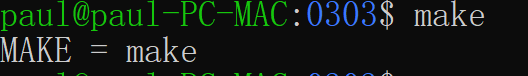
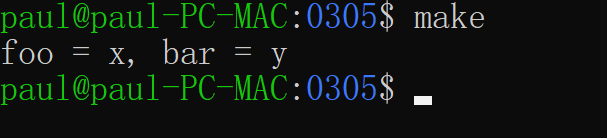

参考资料：
[makefile详解](https://www.cnblogs.com/paul-617/p/15501875.html)
[makefile 完美教程](https://www.cnblogs.com/wittxie/p/9836097.html)
[Makefile概念入门](https://zhuanlan.zhihu.com/p/29910215)


Makefile：类似一个脚本文件，定义了一系列的规则来指定，哪些文件需要先编译，哪些文件需要后编译，哪些文件需要重新编译，甚至于进行更复杂的功能操作，有效地描述这些文件之间的依赖关系以及处理命令。当个别文件改动后，仅执行必要的处理，而不必重复整个编译过程。

不同的系统平台有不同的make工具（编译工具），如 GNU make，qmake，MS nmake等。不同的make工具遵循着不同的规范和标准，所执行的Makefile格式也不同。

Cmake：允许开发者编写一种平台无关的CmakeList.txt文件来制定整个编译流程，然后再根据目标用户的平台进一步生成所需的本地化Makefile和工程文件。


makefile三要素：目标、依赖、命令
```
<target1 > <target2>.... : <prerequisites1> <prerequisites2>...
      <command1>
      <command2>
....
```
`target`可以是一个目标文件，执行文件或标签。
`prerequisites`就是，要生成那个target所需要的文件或是目标。
`command`也就是make需要执行的命令（任意sh脚本）。

### 一个简单的例子
```makefile
all:
	echo "Hello world"
test:
	echo "test game"
```
运行结果：


上面Makefile 中的 all 就是我们的⽬标，放在 `:` 的前⾯，其名字可以是由字⺟和下划线组成 。echo “Hello World”就是⽣成⽬标的命令，这些命令可以是任何你可以在你的环境中运⾏的命令以及 make 所定义的函数等等。all ⽬标的定义，其实是定义了如何⽣成 all ⽬标，这我们也称之为规则。

对上面的makefile进行一个改动，也就是在命令前加上一个@，这个符号就是告诉make，在运行的时候这一行命令不显示出来。
```makefile
all:
    @echo "Hello world"
test:
	@echo "test game"
```
运行结果：


紧接着对makefile进行如下的改动，在all的后面加上test
```makefile
all: test
	@echo "Hello world"
test:
	@echo "test game"
```
运行结果：


### 一个复杂的例子
```C
#include <stdio.h>
 
void foo()
{
    printf("this is foo() !\n");
}
```
`extern`用于声明一个外部的变量或函数。
```c
extern void foo();
 
int main()
{
    foo();
    return 0;
}
```
makefile
```makefile
all: main.o foo.o
	gcc -o simple main.o foo.o
main.o: main.c
	gcc -o main.o -c main.c
foo.o: foo.c
	gcc -o foo.o -c foo.c
clean:
	rm simple main.o foo.o
```
运行结果

第⼆次编译并没有构建⽬标⽂件的动作，但为什么有构建simple可执⾏程序的动作呢？

make 在检查⼀个规则时，采⽤的⽅法是：如果先决条件中相关的⽂件的时间戳⼤于⽬标的时间戳，即先决条件中的⽂件⽐⽬标更新，则知道有变化，那么需要运⾏规则中的命令重新构建⽬标。

对于 simple 项⽬，其依赖树中包括三个规则，make 会检查所有三个规则当中的⽬标（⽂件）与先决条件（⽂件）之间的时间先后关系，从⽽来决定是否要重新创建规则中的⽬标。

第二次构建的目标是all，而all在我们编译的过成中并不生成，所以第二次make的时候找不到，所以又重新编译了一遍。

一个文件是否改变不是看这个文件的大小是否改变，而是看这个文件的时间戳是否发生了变化。可以直接使用touch指令对文件的时间戳进行修改。


### 假目标

如上图，如果我们的创建了一个clean文件之后，继续去运行make clean，这时候不是按照我们前面运行的make clean进行清理文件。

为什么出现上面的原因？因为这个时候make 将clean单程是一个文件，并且在当前的目录下找到了这个文件，再加上clean目标没有任何的先决条件，这时候进行make clean时，系统会认为clean是最新的。

如何解决上面的问题？使用假目标，假目标最从常用清净就是避免所定义的目标和的已经存在文件是从重名的情况，假⽬标可以采⽤.PHONY 关键字来定义，需要注意的是其必须是⼤写字⺟。使用假目标修改makefile.

```makefile
.PHONY: clean
simple: main.o foo.o
	gcc -o simple main.o foo.o
main.o: main.c
	gcc -o main.o -c main.c
foo.o: foo.c
	gcc -o foo.o -c foo.c
clean:
	rm simple main.o foo.o
```
运行结果：


#### 变量
```
.PHONY: clean
CC = gcc
RM = rm
EXE = simple
OBJS = main.o foo.o
$(EXE): $(OBJS)
	$(CC) -o $(EXE) $(OBJS)
main.o: main.c
	$(CC) -o main.o -c main.c
foo.o: foo.c
	$(CC) -o foo.o -c foo.c
clean:
	$(RM) $(EXE) $(OBJS)
```


变量的使用可以提高makefile的可维护性。⼀个变量的定义很简单，就是⼀个名字（变量名）后⾯跟上⼀个等号，然后在等号的后⾯放这个变量所期望的值。对于变量的引⽤，则需要采⽤$(变量名)或者${变量名}这种模式。在这个 Makefile 中，我们引⼊了 CC 和 RM 两个变量，⼀个⽤于保存编译器名，⽽另⼀个⽤于指示删除⽂件的命令是什么。还有就是引⼊了 EXE 和 OBJS 两个变量，⼀个⽤于存放可执⾏⽂件名，可另⼀个则⽤于放置所有的⽬标⽂件名。采⽤变量的话，当我们需要更改编译器时，只需更改变量赋值的地⽅，⾮常⽅便，如果不采⽤变量，那我们得更改每⼀个使⽤编译器的地⽅，很是麻烦。

#### 自动变量
对于每⼀个规则，⽬标和先决条件的名字会在规则的命令中多次出现，每⼀次出现都是⼀种麻烦，更为麻烦的是，如果改变了⽬标或是依赖的名，那得在命令中全部跟着改。有没有简化这种更改的⽅法呢？这我们需要⽤到 Makefile 中的⾃动变量，最常用包括：

- `$@`⽤于表示⼀个规则中的⽬标。当我们的⼀个规则中有多个⽬标时，`$@`所指的是其中任何造成命令被运⾏的⽬标。
- `$^`则表示的是规则中的所有先择条件。
- `$<`表示的是规则中的第⼀个先决条件。

```makefile
.PHONY:all
all:first second third
	@echo "\$$@ = $@"
	@echo "\$$^ = $^"
	@echo "\$$< = $<"
 
first second third:
```


需要注意的是，在 Makefile 中`$`具有特殊的意思，因此，如果想采⽤ echo 输出`$`，则必需⽤两个连着的`$$`。还有就是，`$@`对于 Shell 也有特殊的意思，我们需要在 `$$@` 之前再加⼀个解释字符 `\`。

修改simple的makefile
```
.PHONY: clean
CC = gcc
RM = rm
EXE = simple
OBJS = main.o foo.o
$(EXE): $(OBJS)
	$(CC) -o $@ $^
main.o: main.c
	$(CC) -o $@ -c $^
foo.o: foo.c
	$(CC) -o $@ -c $^
clean:
	$(RM) $(EXE) $(OBJS)
```
运行结果


#### 特殊变量

###### make变量
它表示的是make 命令名是什么。当我们需要在 Makefile 中调⽤另⼀个 Makefile 时需要⽤到这个变量，采⽤这种⽅式，有利于写⼀个容易移植的 Makefile。

```makefile
.PHONY: clean
all:
	@echo "MAKE = $(MAKE)"
```



###### MAKECMDGOALS变量
表示的是当前⽤户所输⼊的 make ⽬标是什么。
```
.PHONY: all clean
all clean:
	@echo "\$$@ = $@"
	@echo "MAKECMDGOALS = $(MAKECMDGOALS)"
```

运行结果：

从测试结果看来，MAKECMDGOALS 指的是⽤户输⼊的⽬标，当我们只运⾏ make 命令时，虽然根据
Makefile 的语法，第⼀个⽬标将成为缺省⽬标，即 all ⽬标，但 MAKECMDGOALS 仍然是空，⽽不是
all，这⼀点我们需要注意。

###### 递归扩展变量
示例了使⽤等号进⾏变量定义和赋值，对于这种只⽤⼀个“=”符号定义的变量，我们称之为递归扩展变量（recursively expanded variable）。

```
.PHONY: all
foo = $(bar)
bar = $(ugh)
ugh = Huh?
all:
	@echo $(foo)
```


除了递归扩展变量还有⼀种变量称之为简单扩展变量（simply expanded variables），是⽤“:=”操作符
来定义的。对于这种变量，make 只对其进⾏⼀次扫描和替换。

```
.PHONY: all
x = foo
y = $(x) b
x = later
xx := foo
yy := $(xx) b
xx := later
all:
	@echo "x = $(y), xx = $(yy)"
```


另外还有一种条件赋值符“？=”，条件赋值的意思是当变量以前没有定义时，就定义它并且将左边的值赋值给它，如果已经定义了那么就不再改变其值。条件赋值类似于提供了给变量赋缺省值的功能。

```
.PHONY: all
foo = x
foo ?= y
bar ?= y
all:
	@echo "foo = $(foo), bar = $(bar)"
```



此外，还有"+="操作符，对变量进⾏赋值的⽅法

```
.PHONY: all
objects = main.o foo.o bar.o utils.o
objects += another.o
all:
	@echo $(objects)
```


###### override指令

在设计 Makefile 时，我们并不希望⽤户将我们在 Makefile 中定义的某个变量覆盖掉，那就得⽤ override 指令了。
```
.PHONY: all
override foo = x
all:
	@echo "foo = $(foo)"
```

运行结果：


##### 模式
如果对于每⼀个⽬标⽂件都得写⼀个不同的规则来描述，那会是⼀种“体⼒活”，太繁了！对于⼀个⼤型项⽬，就更不⽤说了。Makefile 中的模式就是⽤来解决我们的这种烦恼的。

```
.PHONY: clean
CC = gcc
RM = rm
EXE = simple
OBJS = main.o foo.o
$(EXE): $(OBJS)
	$(CC) -o $@ $^
%.o: %.c
	$(CC) -o $@ -c $^
clean:
	$(RM) $(EXE) $(OBJS)
```

与 simple 项⽬前⼀版本的 Makefile 相⽐，最为直观的改变就是从⼆条构建⽬标⽂件的规则变成了⼀条。
模式类似于我们在 Windows 操作系统中所使⽤的通配符，当然是⽤`%`⽽不是`*`。采⽤了模式以后，
不论有多少个源⽂件要编译，我们都是应⽤同⼀个模式规则的，很显然，这⼤⼤的简化了我们的⼯作。使
⽤了模式规则以后，你同样可以⽤这个 Makefile 来编译或是清除 simple 项⽬，这与前⼀版本在功能上是
完全⼀样的。

##### 函数

函数是 Makefile 中的另⼀个利器，现在我们看⼀看采⽤函数如何来简化 simple 项⽬的 Makefile。对于
simple 项⽬的 Makefile，尽管我们使⽤了模式规则，但还有⼀件⽐较恼⼈的事，我们得在这个Makefile
中指明每⼀个需要被编译的源程序。对于⼀个源程序⽂件⽐较多的项⽬，如果每增加或是删除⼀个⽂件都
得更新 Makefile，其⼯作量也不可⼩视！

采⽤了 wildcard 和 patsubst 两个函数后 simple 项⽬的 Makefile。可以先⽤它来编译⼀下 simple 项⽬代码以验证其功能性。需要注意的是函数的语法形式很是特别，对于我们来说只要记住其形式就⾏了。

```makefile
.PHONY: clean
CC = gcc
RM = rm
EXE = simple
SRCS = $(wildcard *.c)
OBJS = $(patsubst %.c,%.o,$(SRCS))
$(EXE): $(OBJS)
	$(CC) -o $@ $^
%.o: %.c
	$(CC) -o $@ -c $^
clean:
	$(RM) $(EXE) $(OBJS)
```

现在，我们来模拟增加⼀个源⽂件的情形，看⼀看如果我们增加⼀个⽂件，在 Makefile 不做任  
何更改的情况下其是否仍能正常的⼯作。增加⽂件的⽅式仍然是采⽤ touch 命令，通过 touch 命令  
⽣成⼀个内容是空的 bar.c 源⽂件，然后再运⾏ make 和 make clean。


###### addprefix函数

addprefix 函数是⽤来在给字符串中的每个⼦串前加上⼀个前缀，其形式是：$(addprefix prefix, names...)

```
.PHONY:all
without_dir= foo.c bar.c main.c
with_dir:=$(addprefix objs/, $(without_dir))
all:
	@echo $(with_dir)
```


###### filter函数

filter 函数⽤于从⼀个字符串中，根据模式得到满⾜模式的字符串，其形式是：$(filter pattern..., text)

```
.PHONY: all
sources = foo.c bar.c baz.s ugh.h
sources := $(filter %.c %.s, $(sources))
all:
	@echo $(sources)
```


从结果来看，经过 filter 函数的调⽤以后，source变量中只存在.c ⽂件和.s ⽂件了，⽽.h ⽂件则则被过滤掉了。

###### filter-out函数
filter-out 函数⽤于从⼀个字符串中根据模式滤除⼀部分字符串，其形式是：$(filter-out pattern..., text)

```
.PHONY: all
objects = main1.o foo.o main2.o bar.o
result := $(filter-out main%.o, $(objects))
all:
	@echo $(result)
```


###### patsubst函数
patsubst 函数是⽤来进⾏字符串替换的，其形式是：$(patsubst pattern, replacement, text)
```
.PHONY:all
mixed=foo.c bar.c main.o
objects:=$(patsubst %.c, %.o, $(mixed))
all:
	@echo $(objects)
```


上述代码中 mixed 变量中包括了.c ⽂件也包括了.o ⽂件，采⽤patsubst 函数进⾏字符串替换时，我们希望将所有的.c ⽂件都替换成.o ⽂件。上图是最后的运⾏结果。

###### strip
strip 函数⽤于去除变量中的多余的空格，其形式是：$(strip string)
wildcard 是通配符函数，通过它可以得到我们所需的⽂件，这个函数类似我们在 Windows 或Linux 命令⾏中的 `*` 。其形式是：`$(wildcard pattern)`

### 3 makefile进阶
#### 3.1 创建目录
毫⽆疑问，我们在编译项⽬之前希望⽤于存放⽂件的⽬录先准备好，当然，我们可以在编译之前通过⼿动
来创建所需的⽬录，但这⾥我们希望采⽤⾃动的⽅式。

```
.PHONY:all
MKDIR=mkdir
DIRS=objs exes
RM=rm
RMFLAGS=-fr
all:$(DIRS)
$(DIRS):
	$(MKDIR) $@
clean:
	$(RM) $(RMFLAGS) $(DIRS)
```


#### 3.2 增加头文件
```less
.PHONY:all clean
MKDIR=mkdir
RM=rm
RMFLAGS=-fr
CC=gcc
EXE=test
DIRS=objs exes
SRCS=$(wildcard *.c)
OBJS=$(SRCS:.c=.o)
all:$(DIRS) $(EXE)
$(DIRS):
	$(MKDIR) $@
$(EXE):$(OBJS)
	$(CC) -o $@ $^
%.o:%.c
	$(CC) -o $@ -c $^
clean:
	$(RM) $(RMFLAGS) $(DIRS) $(EXE) $(OBJS)
```


#### 3.3 将文件放入目录
```less
.PHONY:all clean
MKDIR=mkdir
RM=rm
RMFLAGS=-fr
CC=gcc
 
DIR_OBJS=objs
DIR_EXE=exes
DIRS=$(DIR_OBJS) $(DIR_EXE)
EXE=test
EXE:=$(addprefix $(DIR_EXE)/, $(EXE))
SRCS=$(wildcard *.c)
OBJS=$(SRCS:.c=.o)
OBJS:=$(addprefix $(DIR_OBJS)/, $(OBJS))
 
all:$(DIRS) $(EXE)
 
$(DIRS):
	$(MKDIR) $@
$(EXE):$(OBJS)
	$(CC) -o $@ $^
$(DIR_OBJS)/%.o:%.c
	$(CC) -o $@ -c $^
clean:
	$(RM) $(RMFLAGS) $(DIRS)
```


