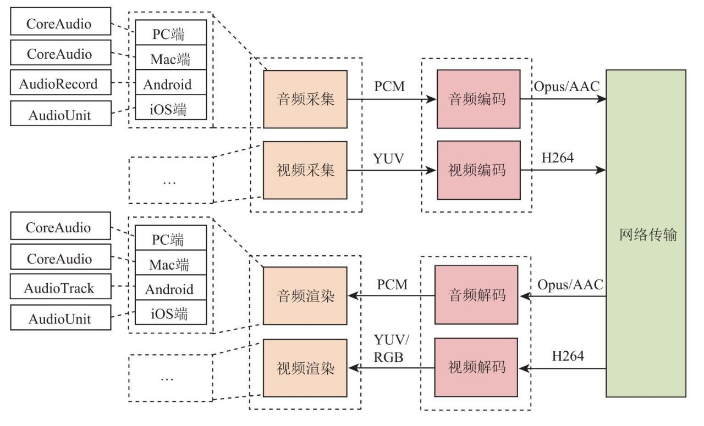
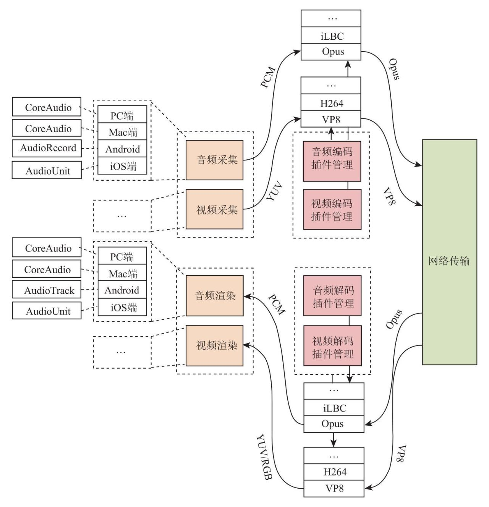

[webrtc官方文档](https://webrtc.org/getting-started/overview)
[webrtc学习指南](https://webrtc.mthli.com/)
[webrtc实现多人会议思路](https://juejin.cn/post/6887147825113595911)
[https证书配置](https://juejin.cn/post/7108000027900903461)
[srs推流代码](https://blog.csdn.net/qq_51677409/article/details/132156222)
[webrtc播放](https://codeantenna.com/a/qaE8915nwW)
[ICE技术](https://zhuanlan.zhihu.com/p/351105085)
[SRS4.0源代码分析之WebRTC服务总体介绍](https://zhuanlan.zhihu.com/p/619492846)

[electron屏幕共享](https://blog.51cto.com/u_15127674/4230997)

使用tcp推流
```less
docker run --rm -it -p 1935:1935 \
  -p 1985:1985 -p 8080:8080 \
  -p 1990:1990 -p 8088:8088 \
  -p 8000:8000/udp \
  -e CANDIDATE="172.16.220.111" \
  registry.cn-hangzhou.aliyuncs.com/ossrs/srs:v5.0.60 \
  ./objs/srs -c conf/https.docker.conf
```

注意：自签名证书，在空白处输入`thisisunsafe`（注意没空格）。


推流测试
https://172.16.220.111:8088/players/rtc_publisher.html
https://172.16.220.111:8088/players/rtc_player.html?schema=https&port=8088&api=8088

webrtc://172.16.220.111:1990/live/livestream


SFU一对一测试

启动信令
```less
docker run --rm -p 1989:1989 registry.cn-hangzhou.aliyuncs.com/ossrs/signaling:1
```

启动httpx-static，转换HTTPS和WSS协议：
```less
docker run --rm -p 80:80 -p 443:443 registry.cn-hangzhou.aliyuncs.com/ossrs/httpx:1 \
./bin/httpx-static -http 80 -https 443 -ssk \
./etc/server.key -ssc ./etc/server.crt \
-proxy http://172.16.220.111:1989/sig -proxy http://172.16.220.111:1985/rtc \
-proxy http://172.16.220.111:8080/
```

docker-compose文件
```less
version: '3'

services:
  srs:
    image: registry.cn-hangzhou.aliyuncs.com/ossrs/srs:v5.0.60
    ports:
      - '1935:1935'
      - '1985:1985'
      - '8080:8080'
      - '1990:1990'
      - '8088:8088'
      - '8000:8000/udp'
    environment:
      - CANDIDATE=172.16.220.111
    command: ./objs/srs -c conf/https.docker.conf

  signaling:
    image: registry.cn-hangzhou.aliyuncs.com/ossrs/signaling:1
    ports:
      - '1989:1989'

  httpx:
    image: registry.cn-hangzhou.aliyuncs.com/ossrs/httpx:1
    ports:
      - '80:80'
      - '443:443'
    command: ./bin/httpx-static -http 80 -https 443 -ssk ./etc/server.key -ssc ./etc/server.crt -proxy http://172.16.220.111:1989/sig -proxy http://172.16.220.111:1985/rtc -proxy http://172.16.220.111:8080/

```


如音频除了可以支持Opus、AAC外，还可以支持G.711/G.722、iLBC、Speex等，视频除了可以支持H264外，还可以支持H265、VP8、VP9、AVI等，这样它才能应用得更广泛。


